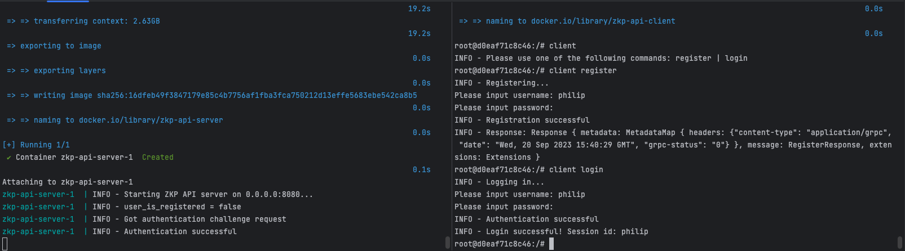

# Zero Knowledge Proof Authentication
This is an example implementation of the Chaum-Pedersen Zero Knowledge Proof protocol in Rust.

## Table of Contents
- [Screenshot of Usage](#screenshot-of-usage)
- [Dependencies](#dependencies)
- [Usage](#usage)
  - [Run in Docker](#run-in-docker)
  - [Run Locally](#run-locally)
- [Implementation Notes](#implementation-notes)
- [Further Improvements](#further-improvements)
- [Quick Links](#quick-links)

## Screenshot of Usage

## Dependencies
- [Rust](https://www.rust-lang.org/tools/install)
- [Docker](https://docs.docker.com/get-docker/)
- [Docker Compose](https://docs.docker.com/compose/install/)
- [Make](https://www.gnu.org/software/make/)

## Usage
### Run in Docker
- Run the server in docker `make run-server`
- Start the client container `make run-client`
  - This will start a bash shell in the client container
  - Run `client-register` or `client-login` to register or login

### Run Locally
- Run the server `make run-server-local`
- Run the client `cargo run --bin client [ register | login ]`

## Implementation Notes
- The storage implemented is a simple on disk storage (scdb) that would not be used in any production setting
- 

## Further Improvements
- [ ] Handle concurrency
  - [ ] On the server potentially using `tokio::task::yield_now` or similar
  - [ ] Handle locking of data access
- [ ] Improve Testing
  - [ ] Mock the server in the client to get better test coverage
  - [ ] Add more tests for the server
  - [ ] Add functional or end to end testing
  - [ ] Add testing for concurrency/scaling
- [ ] Convert the client and server into a library that can be easily implemented for auth from another project
- [ ] Implement real storage options like sql/psql
- [ ] Handle all error cases and provide good error messages
- [ ] Set up easy development through docker container with auto reload/build
- [ ] Implement Elliptic Curve option

## Quick Links
- [Chaum-Pedersen Protocol](https://en.wikipedia.org/wiki/Chaum%E2%80%93Pedersen_protocol)
- [Schnorr Group](https://en.wikipedia.org/wiki/Schnorr_group)